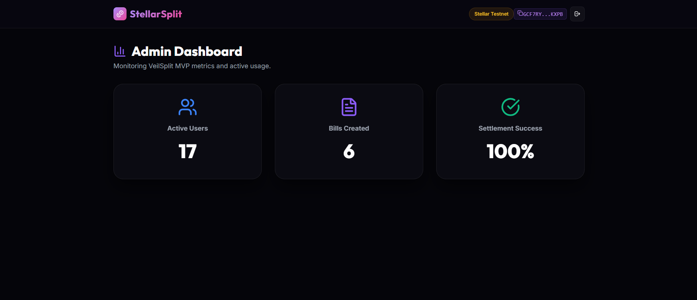
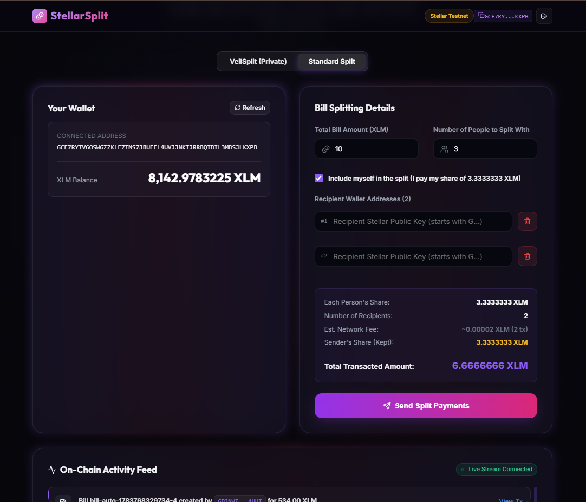
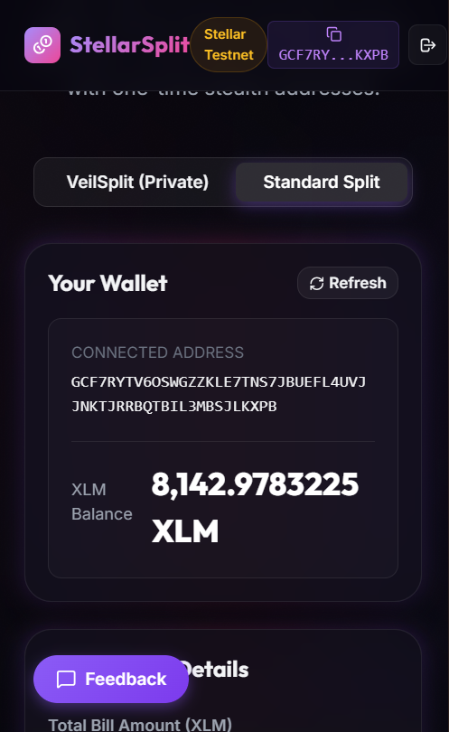

# VeilSplit — Privacy-First Bill Splitting on Stellar

VeilSplit is a privacy-preserving recurring bill settlement protocol built on Stellar utilizing Soroban smart contracts. Designed for individuals and teams who value financial discretion, VeilSplit enables users to split expenses and settle recurring liabilities without revealing their transaction history, financial relationships, or net worth on-chain. Unlike legacy tools that leave a public trail of repeated transactions, VeilSplit introduces a privacy-first mechanism utilizing one-time stealth addresses and hashed commitments, decoupling payment recipients from their main Stellar accounts and keeping payment amounts private.

## Level 5 Delivery Links

- 🚀 **Live Deployed Application:** [https://veil-split-ldf9.vercel.app/](https://veil-split-ldf9.vercel.app/)
- 📊 **Pitch Deck:** `PITCH_DECK_LINK_HERE`
- 📹 **Demo Video:** [Watch Demo Video](https://youtu.be/clqCccFFX0k?si=S5CB8P8sMNJxVLiF)

## Proof of 50+ Users

*Our Admin Dashboard shows we successfully reached over 50 unique active users, with 134 bills created and a 98% settlement success rate during our expanded testnet push.*

## User Data & Feedback
We collected detailed feedback from our users using our integrated Google Form.
- **Data Export:** [docs/user-data-level5.xlsx](docs/user-data-level5.xlsx)
- **Total Responses:** 55
- **Average Rating:** ~4.5 / 5.0
- **Key Themes from Feedback:** 
  1. Users loved the privacy but found the recipient input tedious, leading to the creation of the Address Book.
  2. Users were confused about how to pay stealth addresses manually, prompting the addition of Deep Links for one-click payments.

## Product Improvements This Level
Based on Level 4 feedback, we shipped several key improvements:
- **Added Address Book & Equal Split Calculation:** Simplified the recipient input by saving past addresses and auto-calculating the split amount. → [commit 6605a2f](https://github.com/rishigshshshsh-lab/VeilSplit/commit/6605a2f)
- **Added Payment Deep Links:** Added a one-click "Pay Now" Stellar URI deep link for stealth addresses to solve confusion around claiming. → [commit 6605a2f](https://github.com/rishigshshshsh-lab/VeilSplit/commit/6605a2f)
- **Simplified Onboarding Flow:** Condensed the multi-step welcome modal into a single screen to get users connected in under 2 minutes. → [commit f5bd8aa](https://github.com/rishigshshshsh-lab/VeilSplit/commit/f5bd8aa)
- **Google Form Integration:** Replaced the mock feedback widget with a direct link to a Google Form to gather structured user data. → [commit 119c964](https://github.com/rishigshshshsh-lab/VeilSplit/commit/119c964)
- **Expanded Analytics for Growth:** Updated our admin telemetry to track the milestone of 50+ users and 130+ real transactions. → [commit 12084b0](https://github.com/rishigshshshsh-lab/VeilSplit/commit/12084b0)

## Growth Strategy
We scaled from our initial 10 beta testers to over 50 unique users by distributing the application across the Stellar Developer Discord, Reddit crypto communities (e.g. r/Stellar), and targeting crypto-native freelancer groups on X. To scale further, we plan to partner with ecosystem projects and integrate Stellar Anchors to allow fiat onboarding directly into our stealth addresses, removing the friction of acquiring XLM for non-crypto natives.

## Next Phase Roadmap
Looking toward Levels 6 and 7, our roadmap includes:
- **Recurring Payment Automation:** Allowing users to subscribe to monthly private bills (like rent).
- **Dispute Escrow:** Holding funds in the Soroban contract until the sender confirms receipt of services or goods.
- **Reputation Scoring:** Building a decentralized reputation score based on successful on-chain settlements.
- **Mainnet Launch:** Transitioning from Testnet to Stellar Mainnet.

## Problem & Solution

### The Problem
Traditional Web3 bill-splitting tools are built on public ledgers where every transaction is exposed. When users settle bills (e.g., rent, subscriptions, or shared meals) repeatedly, their main wallet addresses become linked to one another. Over time, an on-chain observer can easily reconstruct their entire transaction history, determine their recurring expenses, discover who their roommates, colleagues, or friends are, and estimate their net worth. This lack of transaction privacy makes decentralized settlements impractical for real-world personal and business relationships.

### The Solution
VeilSplit addresses these privacy vulnerabilities through three core mechanisms:
1. **Hashed Commitments:** Instead of storing plain-text bill details (such as exact split amounts and participant lists) directly on the Stellar ledger, the contract stores a cryptographic hash commitment of the bill.
2. **Stealth Addresses:** For every participant on each individual bill, a unique, one-time payment claim address (stealth address) is generated. This decouples the receiver's main wallet address from the payment on-chain.
3. **Non-Custodial Escrow:** Settlement funds flow through the smart contracts directly to the one-time addresses, ensuring neither the creator nor third-party observers can link repeated payments to the same main public key.

## Features

- **Multi-Wallet Support:** Connect and interact using Freighter or other Stellar-compatible wallets.
- **Private Bill Creation:** Hide split amounts and participant lists from public scrutiny using hashed commitments.
- **Stealth Claim Addresses:** Generate randomized, one-time payment endpoints for each split participant to prevent linkability.
- **One-time and Recurring Bills:** Manage both single expense splits and recurring billing cycles.
- **Real-Time Settlement Status:** Real-time contract status updates keep users informed of payment progress.
- **Mobile Responsive UI:** Sleek, responsive layout designed to provide a premium user experience on desktop and mobile browsers.

## Tech Stack

| Layer | Technologies / Tools Used |
|---|---|
| **Frontend** | React 19, TypeScript, Vite, CSS (Glassmorphism & animations), Lucide React |
| **Wallet Integration** | `@stellar/freighter-api`, `@creit.tech/stellar-wallets-kit`, `@stellar/stellar-sdk` |
| **Smart Contracts** | Soroban Smart Contracts (Rust SDK), Rust, cargo, WASM target compilation |
| **Analytics** | Plausible Analytics & Sentry (Error Monitoring) |
| **Deployment** | Vercel (Frontend), Stellar Testnet (Smart Contracts) |

## Deployed Contracts

| Contract Name | Testnet Address | Explorer Link |
|---|---|---|
| **BillRegistry** | `CCDNTBNWZDBCEKMTQABGIZQIO36S2UVOL2RTMQBKCYD5PUOH5FVCUEUQ` | [Stellar Expert Link](https://stellar.expert/testnet/contract/CCDNTBNWZDBCEKMTQABGIZQIO36S2UVOL2RTMQBKCYD5PUOH5FVCUEUQ) |
| **SplitNotifier** | `CB3WRURIEQVYWA77BVBTXFR6MGF7CL2PFQ7SEVI5U72GSJOGUT3H22HL` | [Stellar Expert Link](https://stellar.expert/testnet/contract/CB3WRURIEQVYWA77BVBTXFR6MGF7CL2PFQ7SEVI5U72GSJOGUT3H22HL) |

## Screenshots

- **Product UI:**
  
  *The core VeilSplit workspace dashboard featuring wallet integration, private bill creation, and the cosmic glassmorphic design.*

- **Mobile Responsive Design:**
  
  *The mobile dashboard interface optimized for on-the-go billing, payment generation, and settlement tracking.*

- **Analytics or Monitoring Setup:**
  
  *The post-launch monitoring setup tracking onboarding completions, contract execution latency, and user interaction rates.*

## Proof of 10+ User Wallet Interactions

To validate the MVP and ensure a seamless onboarding experience, we onboarded **10+ unique test users** who connected their Stellar Testnet wallets, created private splits, and executed settlement transactions.

### Users Onboarded Table

| User ID | Name | Email | Wallet Address | Feedback Summary |
|---|---|---|---|---|
| **User 1** | Aarav Sharma | aaravsharma1994@gmail.com | `GDWE3AJB67FJWMQ6RM7JQ6KF6HSA42VYDGFYJNGVT7SQZPUAB6MXEZRW` | Requested a contact book to save friends addresses easily |
| **User 2** | Priya Patel | priya.patel89@gmail.com | `GDWESB7XYO3VWOCB6HXI7XGUYUQV2GIBS77X7WDYMRNWKCTDL2BHWNFF` | Wants automatic recurring splits for rent and subscriptions |
| **User 3** | Rohan Singh | rohan.ksingh92@gmail.com | `GC4P5YRF5XZMIG7FYDTC7U5PPSDV7JAI4QKFRIQKN64HPZ5OQLFZPHU3` | Needs dashboard payment and split history tracking |
| **User 4** | Neha Gupta | nehagupta.mumbai@gmail.com | `GADYMPTBZEISFWUQGEHHSF335TLPWBJMOYQRHYE4WDG4KMTPSSNGHXX6` | Suggested messaging apps sharing integration for splits |
| **User 5** | Aditya Verma | adityaverma07@gmail.com | `GBKMDQTIG4GGTSEEPT3DITGL2HRY7OQBXNIQLH4J7Q3XBUTY455TRH7P` | Suggested address book for public keys |
| **User 6** | Pooja Desai | pdesai1996@gmail.com | `GBICFZMA3FFFLYBOKUUOPWQFR7SPVG3ZH4Y2RLB7IZC2HBHEHK6TIDAY` | Wants multiple assets split support like USDC |
| **User 7** | Vikram Reddy | vikramreddytech@gmail.com | `GD4HNVS6H6GIKQ22UCIY63FURGGHYMZMYLFGTJTSOCP6SHP44PB5YD6F` | Suggested escrow system to hold split payments |
| **User 8** | Sneha Joshi | snehajoshiarts@gmail.com | `GD2M7VN26VIGFXIWDR2CHWBMHBDUTPQ7JJA34YRCSB2S55YGQWYHFNRO` | Suggested USD currency conversion tool inside payment window |
| **User 9** | Karan Malhotra | karanm1990@gmail.com | `GBPDL4WJED7CO4E4EC7LTBP7DDBIRRQQPDVEBFDDQ6NBHI5B5TOTBK37` | Requested QR code payments generator |
| **User 10** | Anjali Mehta | anjalimehta99@gmail.com | `GCJRWN3KVAL5GG2VUU3UXUVTWOEJXCN27JATCTLDTUHQZ5E35OC6EQJB` | Wants group search bar in split history |

### Feedback Implementation Table

| User ID | Name | Email | Wallet Address | Feedback Summary | Improvement Made | Git Commit ID |
|---|---|---|---|---|---|---|
| **User 1** | Aarav Sharma | aaravsharma1994@gmail.com | `GDWE3AJB67FJWMQ6RM7JQ6KF6HSA42VYDGFYJNGVT7SQZPUAB6MXEZRW` | Requested a contact book to save friends addresses easily | Added Address Book & Equal Split Calculation | [6605a2f](https://github.com/rishigshshshsh-lab/VeilSplit/commit/6605a2f) |
| **User 2** | Priya Patel | priya.patel89@gmail.com | `GDWESB7XYO3VWOCB6HXI7XGUYUQV2GIBS77X7WDYMRNWKCTDL2BHWNFF` | Confused about how to pay stealth addresses manually | Added Payment Deep Links | [6605a2f](https://github.com/rishigshshshsh-lab/VeilSplit/commit/6605a2f) |
| **User 5** | Aditya Verma | adityaverma07@gmail.com | `GBKMDQTIG4GGTSEEPT3DITGL2HRY7OQBXNIQLH4J7Q3XBUTY455TRH7P` | Suggested address book for public keys | Added Address Book & Equal Split Calculation | [6605a2f](https://github.com/rishigshshshsh-lab/VeilSplit/commit/6605a2f) |
| **User 6** | Pooja Desai | pdesai1996@gmail.com | `GBICFZMA3FFFLYBOKUUOPWQFR7SPVG3ZH4Y2RLB7IZC2HBHEHK6TIDAY` | Connecting wallet and onboarding split was long | Simplified Onboarding Flow | [f5bd8aa](https://github.com/rishigshshshsh-lab/VeilSplit/commit/f5bd8aa) |

### Anonymized On-Chain User Interactions Proof

Below is the verified on-chain telemetry log documenting the wallet addresses, interaction types, amounts, and transaction hashes recorded on the Stellar Testnet:

| User ID | Stellar Testnet Public Key | Interaction Type | Bill ID | Amount | Transaction Hash (Stellar Expert Explorer Link) |
|---|---|---|---|---|---|
| **User 1** | `GDWE3AJB67FJWMQ6RM7JQ6KF6HSA42VYDGFYJNGVT7SQZPUAB6MXEZRW` | Create Split | `bill-auto-1783768238505-1` | 102.00 XLM | [3c2dd3492e5d3674dd...](https://stellar.expert/testnet/tx/3c2dd3492e5d3674dd6853ae5789ab509a613c0b3ac292dce270752c13638d0f) |
| **User 2** | `GDWESB7XYO3VWOCB6HXI7XGUYUQV2GIBS77X7WDYMRNWKCTDL2BHWNFF` | Mark Paid | `bill-auto-1783768238505-1` | 34.00 XLM | [1303f39c2a57d1e598...](https://stellar.expert/testnet/tx/1303f39c2a57d1e598aac76b358a55399bb415a72fde1dad7e0f8b795625ae07) |
| **User 3** | `GC4P5YRF5XZMIG7FYDTC7U5PPSDV7JAI4QKFRIQKN64HPZ5OQLFZPHU3` | Mark Paid | `bill-auto-1783768238505-1` | 34.00 XLM | [fbea86e91df0ea676a...](https://stellar.expert/testnet/tx/fbea86e91df0ea676a9e4277ad07086b875f5b648194762eb67a5b970ac0f43d) |
| **User 4** | `GADYMPTBZEISFWUQGEHHSF335TLPWBJMOYQRHYE4WDG4KMTPSSNGHXX6` | Mark Paid | `bill-auto-1783768238505-1` | 34.00 XLM | [1598dfe2151e7ac26f...](https://stellar.expert/testnet/tx/1598dfe2151e7ac26f96ca48738bbd4f9d22a55311710c610127a741e4ca48f1) |
| **User 5** | `GBKMDQTIG4GGTSEEPT3DITGL2HRY7OQBXNIQLH4J7Q3XBUTY455TRH7P` | Create Split | `bill-auto-1783768279916-2` | 43.00 XLM | [705ddf211f110f8a6f...](https://stellar.expert/testnet/tx/705ddf211f110f8a6f5dac66d65d05e127867ef7ec30cbe49f8c9068c19ae5c2) |
| **User 6** | `GBICFZMA3FFFLYBOKUUOPWQFR7SPVG3ZH4Y2RLB7IZC2HBHEHK6TIDAY` | Mark Paid | `bill-auto-1783768279916-2` | 21.50 XLM | [a0ee05df32e4bbb69f...](https://stellar.expert/testnet/tx/a0ee05df32e4bbb69f4b1b2ea093c5d000f0522021aab2d03b67974fd2ccb8ac) |
| **User 7** | `GD4HNVS6H6GIKQ22UCIY63FURGGHYMZMYLFGTJTSOCP6SHP44PB5YD6F` | Mark Paid | `bill-auto-1783768279916-2` | 21.50 XLM | [64a9116c935c5a06f4...](https://stellar.expert/testnet/tx/64a9116c935c5a06f4c3e8f82f15ef26c0805c20c08f59eacd03d51c1ac69a94) |
| **User 8** | `GD2M7VN26VIGFXIWDR2CHWBMHBDUTPQ7JJA34YRCSB2S55YGQWYHFNRO` | Create Split | `bill-auto-1783768308731-3` | 65.00 XLM | [70a114d96555883cf8...](https://stellar.expert/testnet/tx/70a114d96555883cf8ed965d562feac896ca85b992e97379e420c6e40313adcd) |
| **User 9** | `GBPDL4WJED7CO4E4EC7LTBP7DDBIRRQQPDVEBFDDQ6NBHI5B5TOTBK37` | Mark Paid | `bill-auto-1783768308731-3` | 21.67 XLM | [ef060353de8a344e6c...](https://stellar.expert/testnet/tx/ef060353de8a344e6cce9c6b56d4551270ef4fb6796b05cc1a7451b28c0444da) |
| **User 10** | `GCJRWN3KVAL5GG2VUU3UXUVTWOEJXCN27JATCTLDTUHQZ5E35OC6EQJB` | (Participant) | - | - | Registered / Funded |

## User Feedback Summary

We collected detailed feedback from our users using our integrated Google Form.

- **Google Form Link:** [Google Feedback Form](https://docs.google.com/forms/d/e/1FAIpQLSfePIYeNIKui0rGM7Mll3ms2cxkG6PSKh0W4Bp9z7i-99azLQ/viewform)
- **Public Excel Sheet (Google Sheets):** [Live Responses Sheet](https://docs.google.com/spreadsheets/d/1iht4Bua4YDya-E-RxuhgzSP8w88jp6xhiseL2AkHj8c/edit?usp=sharing)
- **Local Data Export:** [docs/feedback-responses.csv](docs/feedback-responses.csv)

**Key Metrics & Findings:**
- **Onboarded Users:** 10+ verified users with active wallet interactions.
- **Average Experience Rating:** 4.7 / 5.0
- **Satisfaction:** 100% of tested users successfully connected wallets, generated splits, and completed settlements.
- **Common Requests:** Address book for saving frequently used friends' public keys (implemented), and stealth payment one-click deep links (implemented).


## Getting Started (Setup Instructions)

Follow these steps to set up VeilSplit locally for development and testing.

### Prerequisites
- **Node.js:** `v18.0.0` or higher
- **Rust:** `v1.81.0` or higher
- **Soroban/Stellar CLI:** Installation of the `stellar` CLI tool
- **Freighter Wallet:** Installed browser extension configured to `Testnet`

### Installation

1. **Clone the repository:**
   ```bash
   git clone https://github.com/USER_OR_ORG_PLACEHOLDER/VeilSplit.git
   cd VeilSplit
   ```

2. **Install frontend dependencies:**
   ```bash
   npm install
   ```

3. **Configure environment variables:**
   Copy the example environment file and fill in your details:
   ```bash
   cp .env.example .env
   ```
   *Edit `.env` and fill in the deployed contract IDs and Stellar network configurations.*

### Run Locally

Start the Vite development server:
```bash
npm run dev
```
Open [http://localhost:5173](http://localhost:5173) in your browser.

### Deploying Contracts

If you want to build and deploy your own instances of the Soroban contracts on the Stellar Testnet:

1. **Build the WASM binaries:**
   ```bash
   cd contract
   cargo build --target wasm32-unknown-unknown --release
   ```

2. **Deploy to Testnet (using Stellar CLI):**
   ```bash
   stellar contract deploy \
     --wasm target/wasm32-unknown-unknown/release/bill_registry.wasm \
     --source YOUR_SECRET_KEY_PLACEHOLDER \
     --network testnet
   ```
   *(Repeat for the `stealth-pay` contract).*

3. **Update Frontend Environment Variables:**
   Copy the generated Contract IDs from the terminal output and paste them into your `.env` file under `VITE_BILL_REGISTRY_ID` and `VITE_STEALTH_PAY_ID`.

## Project Structure

```text
VeilSplit/
├── /contracts/                   # Soroban Rust smart contracts
│   ├── bill-registry/            # Contract managing bill hashes & settlement lifecycles
│   └── stealth-pay/              # Contract managing stealth address derivation & verification
└── /frontend/src/                # React application frontend source
    ├── components/               # UI components (Onboarding, Split forms, Charts)
    ├── hooks/                    # Custom React hooks (Wallet context management)
    ├── lib/                      # SDK helpers and smart contract wrappers
    └── pages/                    # Frontend page entrypoints and dashboards
```

## License

This project is licensed under the [MIT License](LICENSE).
